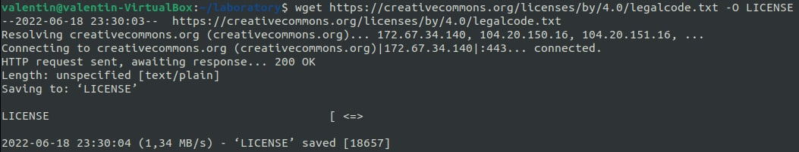
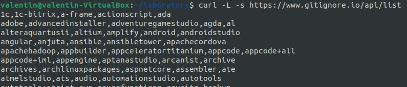

                       РОССИЙСКИЙ УНИВЕРСИТЕТ ДРУЖБЫ НАРОДОВ

               Факультет физико-математических и естественных наук

               Кафедра прикладной информатики и теории вероятностей

                                      ОТЧЕТ

                            ПО ЛАБОРАТОРНОЙ РАБОТЕ №2 	

                          дисциплина:Операционные системы		 

                                        Студент: 
                                        Белицкий Валентин Александрович                                 

                                        Группа: НПМбв-01-18                                      

                                      МОСКВА

                                      2022 г.

# **Цель работы**

Изучить идеологию и применение средств контроля версий.

# **Ход работы**

## **Настройка git**

1\) Cоздание учётной записи на Github

2\) Настройка системы контроля версий git

## **Подключение репозитория к GitHub**

1\) генерируем ssh ключ

2)Копируем полученный ключ и вставляем в гитхаб

3\) Создаём репозиторий на GitHub

4\) инициализируем репозиторий

5\) Подключаемся к репозиторию os-intro

6\) Создаём заготовку для файла README.md и отправляем на Github

# **Первичная конфигурация**
Добавим файл лицензии:

Добавим шаблон игнорируемых файлов. Просмотрим список имеющихся шаблонов:

Затем скачаем шаблон, например, для C:

Добавим новые файлы:

# **Конфигурация git-flow**
Инициализируем git-flow

Проверьте, что Вы на ветке develop:

Создадим релиз с версией 1.0.0

Запишем версию:

Добавим в индекс:

Отправим данные на github

# **Вывод**
В ходе выполнения лабораторной работы №2 были освоены навыки администрирования и взаимодействия с децентрализованной системой и операционной системой git для параллельного контроля поддержки программного кода.

# **Контрольные вопросы**

1\. Что такое системы контроля версий (VCS) и для решения каких задач
они предназначаются?

Системы контроля версий (VCS) -- это программное обеспечение для
облегчения работы с изменяющейся информацией. Предназначаются для работы
нескольких человек над одним проектом, совместная работа путем изменения
файлов в одном репозитории.

2\. Объясните следующие понятия VCS и их отношения: хранилище, commit,
история, рабочая копия.

-   Хранилище -- это общее пространство для хранения файлов

-   Commit -- это команда для записи индексированных изменений в
    репозитории

-   В истории сохраняются все коммиты, по которым можно отследить
    автора, сообщение, дату и хэш коммита

-   Все файлы кроме .git/ называются рабочей копией, и принадлежат
    пользователю

3\. Что представляют собой и чем отличаются централизованные и
децентрализованные VCS? Приведите примеры VCS каждого вида.

Централизованные системы контроля версий сохраняют проект и его файлы на
один общий сервер, а децентрализованные системы контроля версий при
каждом копировании данных удаленного репозитория, происходит полное
копирование данных в локальный репозиторий. К примеру, централизованные
системы контроля версий -- SVN, MS TFS, ClearCase; децентрализованные
системы контроля версий -- Git, Mercurial, Bazaar.

4\. Опишите действия с VCS при единоличной работе с хранилищем.

1)  Создаем репозиторий и именуем его

2)  Добавляем файлы в репозиторий

3)  Фиксируем с помощью коммитов

4)  Изменяем файлы репозитория и фиксируем изменения

5\. Опишите порядок работы с общим хранилищем VCS.

1)  Создаем репозиторий, именуем его или присоединяемся к нему в
    качестве contributor

2)  Добавляем файлы в репозиторий

3)  Фиксируем с помощью коммитов

4)  Изменяем файлы репозитория и фиксируем изменения

5)  Ждем проверки коммитов при участии других пользователей в общем
    репозитории

6\. Каковы основные задачи, решаемые инструментальным средством git?

Систематизация, параллельность разработки программного обеспечения,
единое месть для хранения файлов проекта

7\. Назовите и дайте краткую характеристику командам git.

-   Git init -- создание репозитория,

-   Git clone -- клонирование репозитория,

-   Git add -- добавление изменений в индекс,

-   Git reset -- удаление изменений из индекса,

-   Git commit -- коммиты,

-   Git rm -- удаление файла.

8\. Приведите примеры использования при работе с локальным и удалённым
репозиториями.

К примеру, я использую локальные репозитории для черновых работ по
лабораторным работам, а удаленный репозиторий git для их распространения
и оценивания преподавателем.

9\. Что такое и зачем могут быть нужны ветви (branches)?

Ветви служат для параллельной разработки программного обеспечения,
тестирования, отладки и улучшения

10\. Как и зачем можно игнорировать некоторые файлы при commit?

Игнорирование можно установить для проекта, компьютера и репозитория,
цель игнорирования заключается в том, чтобы не отслеживать файлы
служебного типа, например временные файлы сборных утилит для проектов
или только те файлы, которые полезны при взаимодействии только с очень
ограниченным программным обеспечением
