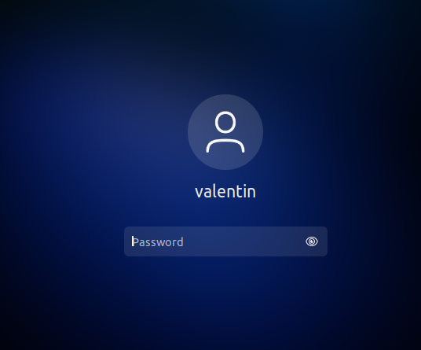
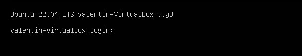
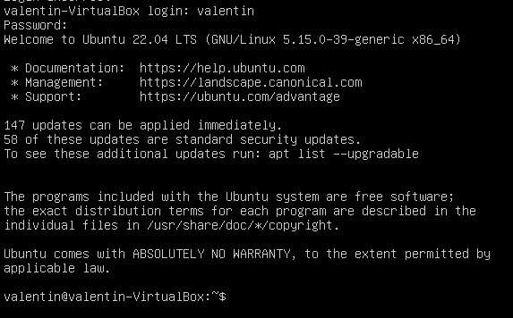
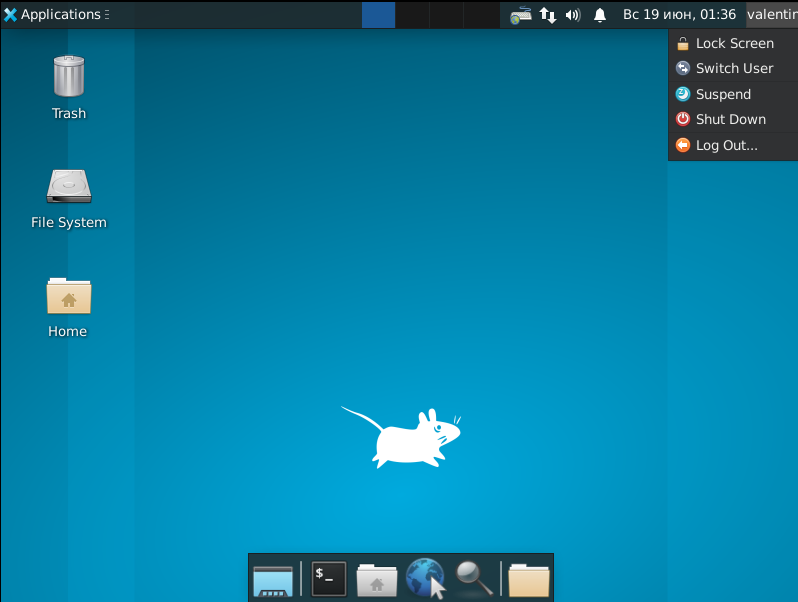
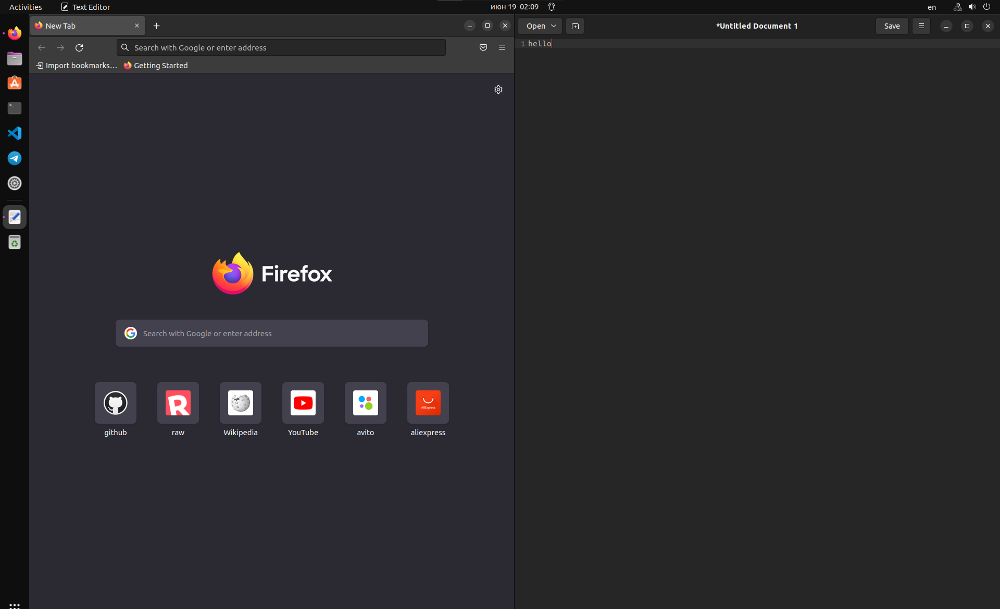
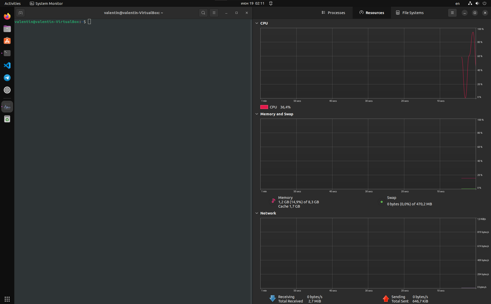

                       РОССИЙСКИЙ УНИВЕРСИТЕТ ДРУЖБЫ НАРОДОВ

               Факультет физико-математических и естественных наук

               Кафедра прикладной информатики и теории вероятностей

                                      ОТЧЕТ

                            ПО ЛАБОРАТОРНОЙ РАБОТЕ №4 	

                          дисциплина:Операционные системы		 

                                        Студент: 
                                        Белицкий Валентин Александрович                                 

                                        Группа: НПМбв-01-18                                      

                                      МОСКВА

                                      2022 г.

# **Цель работы**

Познакомиться с операционной системой Linux, получить практические
навыки работы с консолью и некоторыми графическими менеджерами рабочих
столов операционной системы.

# **Задания**

1\) Ознакомиться с теоретическим материалом.

2\) Загрузить компьютер.

3\) Перейти на текстовую консоль. Сколько текстовых консолей доступно на
вашем компьютере?

Ответ: 4 текстовых консоли от tty3 до tty6.

4\) Перемещаться между текстовыми консолями. Какие комбинации клавиш
необходимо при этом нажимать?

Ответ: Перемещение с помощью комбинаций Alt+Fn (n -- от 3 до 6).

5\) Зарегистрироваться в текстовой консоли операционной системы. Какой
логин вы при этом использовали? Какие символы отображаются при вводе
пароля?

Ответ: логин valentin и символы пароля не отображаются в целях
безопасности.

6\) Завершить консольный сеанс. Какую команду или комбинацию клавиш
необходимо для этого использовать?

Ответ: комбинация клавиш Сtrl+D.

7\) Переключиться на графический интерфейс. Какую комбинацию клавиш для
этого необходимо нажать?

Ответ: комбинация клавиш Alt+F2.

8\) Ознакомиться с менеджером рабочих столов. Как называется менеджер,
запускаемый по умолчанию?

Ответ: менеджер Openbox.

9\) Поочерёдно зарегистрироваться в разных графических менеджерах
рабочих столов (GNOME, KDE, XFCE) и оконных менеджерах (Openbox).
Продемонстрировать разницу между ними, сделав снимки экрана (скриншоты).
Какие графические менеджеры установлены на вашем компьютере?

Ответ: Помимо Gnome установлен Xfce4.

10\) Изучить список установленных программ. Обратить внимание на
предпочтительные программы для разных применений. Запустите поочерёдно
браузер, текстовой редактор, текстовой процессор, эмулятор консоли.
Укажите названия программ.

# **Вывод**

В ходе выполнения Лабораторной работы №4, были приобретены навыки по
администрированию и взаимодействию с разными окружениями в операционной
среде Linux.

# **Контрольные вопросы**

1\) Что такое компьютерный терминал? Есть ли, по вашему мнению, у него
преимущества перед графическим интерфейсом?

Ответ: Компьютерный терминал - посредник между человеком и машиной,
человек дает команду терминалу в виде сивольных и числовых литерал,
терминал переводит эти команды в понятный для машины язык (чаще всего
Си, Ассемблер, иногда Rust), преимущества компьютерного терминала
заключаются в моментальной реакции, простейший пример промышленный
компьютер или бортовой компьютер космического корабля Союз-МС должен
реагировать на команды оператора за доли секунды, тем более что
графический интерфейс дожен рендериться, а в условиях космоса или
промышленного оборудования растрата памяти и нагрузка процессора прямо
противопоказана.

2\) Что такое входное имя пользователя?

Ответ: Операционная система Linux связывает входное имя с
идентификатором пользователя в системе (UID - User ID)

3\) В каком файле хранятся пароли пользователей? В каком виде они
хранятся?

Ответ: Файл \`/etc/passwd\` содержит учетные записи пользователей и
пароли для входа в систему

4\) Где хранятся настройки пользовательских программ?

Ответ: Настройки программ находятся по пути: \`\~/.config/
(/home/user/.config/)

5\) Какое входное имя у администратора ОС Unix?

Ответ: UID Root = 0

6\) Имеет ли администратор доступ к настройкам пользователей?

Ответ: Да

7\) Каковы основные характеристики многопользовательской модели
разграничения доступа?

Ответ: Самая главная - раграничение на пользователей и администраторов,
позволяет добиться неизменения системы пользователем, однако чаще всего
позволяет это сделать другими способами, намного быстрее чем такая
система управления доступом

8\) Какую информацию кроме пароля и логина содержит учётная запись
пользователя?

Ответ: имя пользователя (account), пароль (password), UID, GID, GECOS
(дополнительная информация о пользователе), домашняя директория
(directory), оболочка (используемая пользователем оболочка).

9\) Что такое UID и GID? Расшифруйте эти аббревиатуры.

Ответ: UID - User ID, GID - Group ID

10\) Что такое GECOS?

Ответ: Поле, содержащее в себе дополнительные данные о пользователе -
номер телефона, адрес, полное имя и рабочий телефон.

11\) Что такое домашний каталог? Какие файлы хранятся в нем?

Ответ: У каждого пользователя хранятся свои файлы отдельно от файлов
других пользователей, для этого при создании каждого пользователя
создается отдельный каталог.

12\) Как называется ваш домашний каталог?

Ответ: \`/home\`.

13\) Имеет ли администратор возможность изменить содержимое домашнего
каталога пользователя?

Ответ: Да.

14\. Что хранится в файле /etc/passwd?

Ответ: Текстовый файл, содержащий список пользователей (учетных записей)

15\) Как, просмотрев содержимое файла /etc/passwd, узнать, какие
пользователи не смогут войти в систему?

Ответ: \`cat /etc/passwd\` -\> \`sed \'s/:.\*//\' /etc/passwd\` -\>
\`w\` -\> \`last -a\` -\> \`lastlog\`.

16\) Что такое виртуальные консоли? Как вы думаете, что означает слово
«виртуальный» в данном контексте?

Ответ: Несколько параллельно выполняемых программ, но при этом нельзя
вызвать два процесса в двух разных терминалах, например нельзся
устанавливать \`discord.deb\`, пока идет скачивание каталогов для
обновления системы, так как эти два с виду не похожих команды используют
одинаковый процесс \`apt\`.

17\) Зачем нужна программа getty?

Ответ: Более известная как tty (PuTTY), используется для удаленного
доступа к терминалам любых операционных систем по криптографически
устойчивому к атакам извне и внутри сети протоколу передачи данных
\"SSH\".

18\) Что такое сеанс работы?

Ответ: Момент времени, с которого пользователь залогинился в систему и
вышел из своей учетной записи или выключил компьютер.

19\) Что такое тулкит?

Ответ: Пакет прикладного или системного программного обеспечения
объединенного в один комбайн по схожести выполнения работ, например
Cryptographic ToolKit - из названия понятно что все программы внутри
этого тулкита будут собраны по отрасли применения (в данном случае
конктрено применимо к криптографии)

20\) Какие основные тулкиты существуют в системе Unix?

Ответ: POSIX (Portable Operating System Interfaves Unix) - является
самым главным из них, GTK+, Qt,
